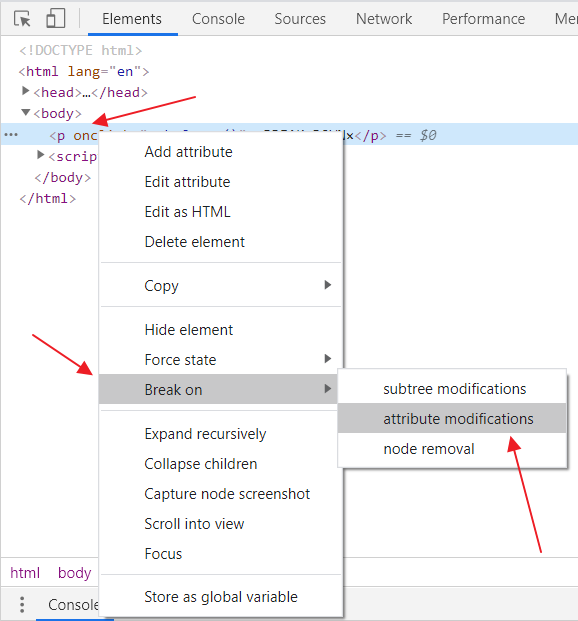

# Dev Tools Domination

[< Back to table of content](../../README.md) |
[View previous exercice's notes >](../08-Fun.with.HTML5.Canvas/Notes.md) |
[View next exercice's notes >](../10-Hold.Shift.and.Check.Checkboxes/Notes.md)

## Trick #1: find where a DOM element is modified



## Trick #2: Console log

Nothing to same.

## Trick #3: Console log Interpolated

`console.log('Hello I am a %s string!', '💩');`

But with the back ticks of ES6, it is not really used.

## Trick #4: Console warning

Used when something is not blocking yet but could become so.

## Trick #5: Console error

Used when catching an error.

## Trick #6: Console info

When and where should we use this, it is a good question.

## Trick #7: Console assert

Can be a nice way to test your code?
Using JavaScript Errors Notifier extension in Chrome, any failed assertion would show up!

## Trick #8: Console clear

No really useful.

## Trick #9: Console log a DOM element

```js
console.log(p); //logs the DOM element as HTML
console.dir(p); //logs the DOM element, including methods and properties
```

## Trick #10: Console grouping

```js
const dogs = [
  { name: 'Snickers', age: 2 },
  { name: 'hugo', age: 8 },
];
dogs.forEach((dog) => {
  const groupName = `${dog.name}`;
  console.groupCollapsed(groupName));
  console.log(`This is ${dog.name}`);
  console.log(`${dog.name} is ${dog.age} years old`);
  console.log(`${dog.name} is ${dog.age * 7} dog years old`);
  console.groupEnd(groupName);
});
```

## Trick #11: Console count

What is the usecase?

## Trick #12: Console timer

```js
const timerName = 'fetching data';
console.time(timerName);
fetch('https://api.github.com/users/wesbos')
  .then((data) => data.json())
  .then((data) => {
    console.timeEnd(timerName);
    console.log(data);
  });
```

## Trick #13: Console table

That one, I find pretty useful to format an array of object!

## Trick #14

I must have taken 2 tricks in one!
