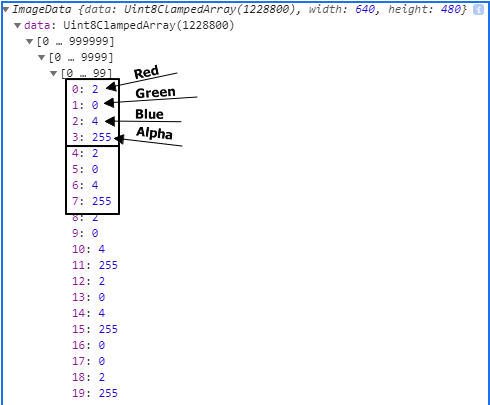

# Webcam fun

[< Back to table of content](../README.md) |
[View previous exercice's notes >](../18-Adding.Up.Times.with.Reduce/Notes.md) |
[View next exercice's notes >](../20-Speech.Detection/Notes.md)

## Instructions

We need to:

- 1. get the webcam feed => ok
- 2. continuously draw the last frame of the video as a photo in a canvas
- 3. change the appearance of the frame in the canvas
  - add a ["green screen" effect](https://www.google.com/search?q=green+screen+effect)
- 4. be able to download the frame as an image from the canvas

### Task 2

How do we paint the last frame **continuously** in the canvas?

- 1. How do we get the frame
  - Found nothing in [this MDN](https://developer.mozilla.org/en-US/docs/Web/API/MediaStream)
  - What does allow to run some code continuously in JavaScript? `setInterval`!
- 2. How do we paint an image into the canvas?
  - [MDN](https://developer.mozilla.org/en-US/docs/Web/API/CanvasRenderingContext2D/drawImage) says the `image` parameter of `drawImage` can be an `HTMLVideoElement`.
- 3. What size should the canvas be?
  - The size the video captured: [height](https://developer.mozilla.org/en-US/docs/Web/API/HTMLVideoElement/videoHeight) and [width](https://developer.mozilla.org/en-US/docs/Web/API/HTMLVideoElement/videoWidth)

### Task 3

To modify the actual frame, we need to read a frame as an image.

The image is actually a huge array of `rgba` values (4 values) of each individual pixel.

Each value is a bit ranging from 0 to 255.

From there, you can play with the value to obtain which ever filter you want.

### Task 4

To get the image as jpeg, we can use [toDataURL](https://developer.mozilla.org/en-US/docs/Web/API/HTMLCanvasElement/toDataURL) of the canvas element.

For the supported formats, check out MDN.
