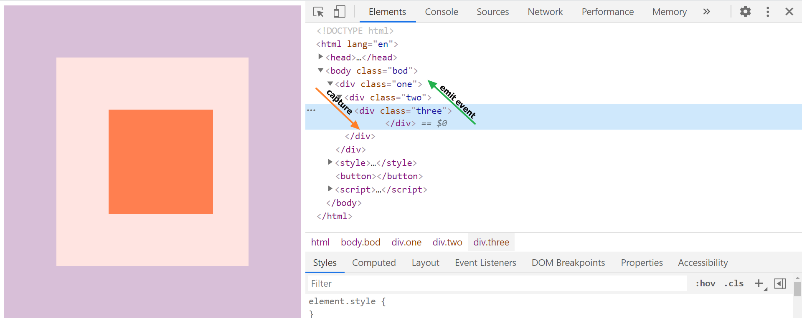
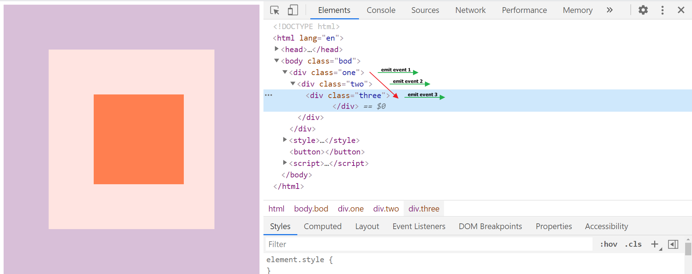

# Event Capture, Propagation, Bubbling and Once

[< Back to table of content](../../README.md) |
[View previous exercice's notes >](../24-Sticky.Nav/Notes.md) |
[View next exercice's notes >](../26-Stripe.Follow.Along.Nav/Notes.md)

## Notes

### Example 1

In [the example](../../exercices/25-Event.Capture,.Propagation,.Bubbling.and.Once/index-FINISHED.html), when we click the `three` div, the click event is `captured` on the way in the DOM to the clicked element.

All elements that are hierarchically wrapping the clicked elements will then emit an event on the way in the DOM tree (also called `bubbling up`).

```js
const divs = document.querySelectorAll('div');

function logText(e) {
  //will be run 3 times because the
  // div three is nested into the div two,
  // and div two is nested into div one, etc...
  console.log(this.classList.value);
}

divs.forEach((div) => div.addEventListener('click', logText));
```



### Example 2

Using the `capture: true`, that is `false` by default, the event are emitted as they captured (also called `firing on the capture down` in the DOM tree):

```js
const divs = document.querySelectorAll('div');

function logText(e) {
  //will be run 3 times:
  // first, div one,
  // then div two
  // and finally div three.
  console.log(this.classList.value);
}

divs.forEach((div) =>
  div.addEventListener('click', logText, { capture: true }),
);
```



### No propagation

To prevent the propagation, we can use the `stopPropagation` method to fire only the event of the element clicked, e.g. stop bubbling.

So in the examples, if you clicked on di three, only that one would be logged in the console based on the `capture` value.

- So in example 1, where `capture: false`, when we click on the div three, the log would be from div three.

- So in example 2, where `capture: true`, when we click on the div three, the log would be from div one.

### `once` option

Have you ever had the case where the user clicked a button more than once and he shouldn't have?

Well, that is because the browser **listens** the event as long as we tell him to stop (e.g. `removeEventListener`).

Using the option `once`, you tell the browser: "listen to this event once and then unregister it".

```js
const button = document.querySelector('button');

function logText(e) {
  //will call ONCE no matter
  //how many times the button
  //is clicked
  console.log(this.classList.value);
}
button.addEventListener(
  'click',
  () => {
    console.log('Click!!!');
  },
  {
    once: true,
  },
);
```
